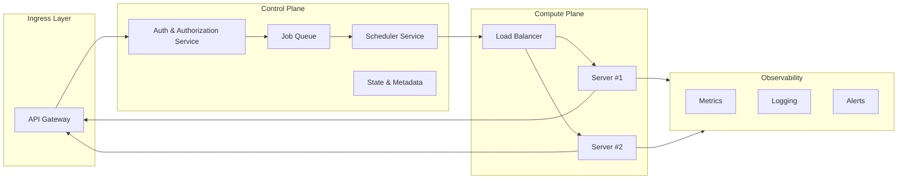

```mermaid
---
config:
  layout: dagre
---
flowchart LR
 subgraph Ingress_Layer["Ingress Layer"]
        APIGW["API Gateway"]
  end
 subgraph Control_Plane["Control Plane"]
        Auth["Auth & Authorization Service"]
        Queue["Job Queue"]
        Scheduler["Scheduler Service"]
        StateDB["State & Metadata"]
  end
 subgraph Compute_Plane["Compute Plane"]
        Balance["Load Balancer"]
        server1["Server #1"]
        server2["Server #2"]
  end
 subgraph Observability["Observability"]
        Metrics["Metrics"]
        Logging["Logging"]
        Alerts["Alerts"]
  end
    APIGW --> Auth
    Auth --> Queue
    Queue --> Scheduler
    Scheduler --> Balance
    Balance --> server1 & server2
    server1 --> APIGW & Observability
    server2 --> APIGW & Observability
```

Architecture as of 7/6/2025