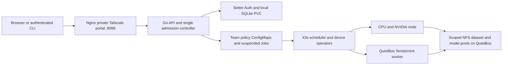

# Architecture

Current private department installation, verified October 9, 2026.
[User/admin policy](department-rollout.md) and [k3s details](k3s-setup.md) cover
its operating contracts.

## Job flow

1. Nginx serves the built SPA and forwards `/api` and `/auth` to Go.
2. Better Auth verifies the account. Go checks current team membership, image
   registry rules, storage scope and resource/runtime/queue policy.
3. The API persists a suspended Job in the team's namespace and prepares its
   scoped output directory. A single controller admits queued jobs fairly.
4. Kubernetes places the admitted pod on the appropriate node. NVIDIA's plugin
   reserves whole GPUs; Tenstorrent DRA reserves whole n300 boards.
5. containerd starts the image. `/inputs` is read-only; `/outputs` is the job's
   own directory in the model pool. Logs/status come from actual pods and Jobs.
6. Jobs and output files remain after exit. Cancellation or revocation stops
   pods and frees reservations while retaining history and outputs.

Nginx currently proxies to one API service; the API must remain one replica
because it owns a single admission controller. Kubernetes placement uses
resource requests and device availability. It does not automatically turn one
submitted model into distributed training across both accelerator types.

## Source organization

| Location | Responsibility |
|---|---|
| `src/main.go`, `app.go` | Process lifecycle, HTTP routes and controller ownership |
| `src/jobs_http.go`, `http.go`, `job_types.go` | Job endpoints, shared responses and wire types |
| `src/kubernetes.go`, `job_states.go`, `outputs.go` | Container specification, execution/state and retained local-output initialization |
| `src/member_auth.go` | Session proxy, identity and authoritative authorization |
| `src/teams.go`, `team_queue.go`, `team_runtime.go`, `team_storage.go` | Membership/policy, fair admission, isolation and scoped storage |
| `src/shared_storage.go`, `hardware.go`, `images.go` | Uploads/results, inventory and image/runtime profiles |
| `auth-service/` | Better Auth and local SQLite persistence |
| `cli/` | Authenticated terminal client; no execution logic |
| `web-interface/` | React portal, typed API client, account/team state and UI components |
| `deploy/k3s/` | Manifests, accelerator diagnostics, live verifiers and evidence |
| `deploy/k3s/storage/` | QuietBox provisioning/migration/growth and service unit |
| `deploy/private/` | Image/web deployment, Nginx and host access rules |
| `docs/` | Current guides; historical records are under `docs/archive/` |

API and CLI are separate Go modules joined by `go.work`. There is no Redis
scheduler or Docker supervisor in the current code. Historical account jobs and
local PVCs remain readable through explicit legacy-workspace compatibility.
Removing the old executor does not delete these Kubernetes resources.

## State and boundaries

- Better Auth uses a main-node local SQLite WAL PVC, not NFS.
- Team policies and queue state live in Kubernetes; no separate queue database.
- Every team has separate bounded dataset and model/result NFS filesystems.
  Member/common folders share their corresponding team's pool.
- Workloads receive scoped mounts, no Kubernetes token, constrained host paths
  and a network policy. Accelerator drivers still share the host kernel.
- Portal/SSH use Tailscale. Cluster API, Flannel and NFS use the LAN.

There is one control plane, one auth instance and one storage host. Availability
and arbitrary-model/distributed-training support are limited as described in the
[operating guide](department-rollout.md).
