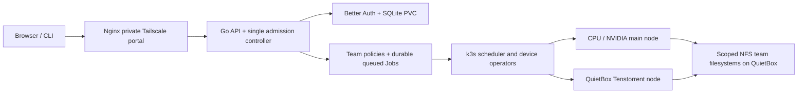
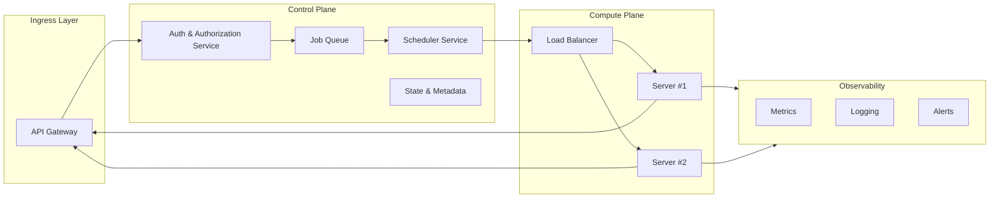

# Architecture

Current private department pilot, October 9, 2026. See
[department rollout](department-rollout.md) for permissions, resource/storage
rules, the API contract and operating limits.

The API authenticates and applies team policy before persisting a suspended Job.
Its single controller admits work fairly; Kubernetes/containerd place and run the
containers using NVIDIA device resources or TT DRA claims. The shared store has
one bounded filesystem per team, read-only input mounts and job-specific outputs.
SSH is for machine administration, not job execution. The current pilot has no
separate Redis scheduler, cloud load balancer or new monitoring product.

Historical architecture sketch — July 6, 2025

Architecture as of 7/6/2025

