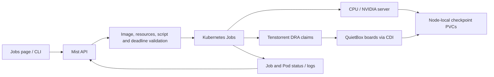

> **Historical record — superseded.** This text describes an earlier phase.
> Commands and claims below are retained as history, not current setup instructions.
> Start with the [current documentation index](../README.md) and
> [department operating guide](../department-rollout.md).

# Kubernetes execution pilot

**October 9 update:** Shared datasets/results, member login and private production
hosting are implemented. Earlier local pilot descriptions below record the
original phase. Use [the current operating guide](complete-foundation.md) for today's behavior.

## Implemented on 2026-10-03

Mist uses Kubernetes `batch/v1` Jobs by default. The API submits actual
commands or uploaded scripts, reports real exit codes and scheduler messages,
retrieves pod logs, and cancels workloads. The CLI and Jobs page use these
endpoints. The optional `MIST_EXECUTOR=docker` path retains the older,
incomplete Docker/Redis supervisor for compatibility.

Kubernetes owns placement, device accounting, and Job lifecycle. Mist validates
submission parameters and configured owner labels. Authentication, team
policy, credits, quotas, priority, and audit accounting are still application
work; the current API is a local single-owner pilot.

See [installation, commands and acceptance tests](k3s-deployment-history.md#mist-api-cli-and-jobs-page)
and [job lifecycle and API endpoints](../../src/jobs.md).

## Hardware and scheduling

| Node | Workload resources | Allocation |
| --- | --- | --- |
| `utmist-z1opa08` | CPU and two NVIDIA RTX A4000 GPUs | `nvidia.com/gpu`, one or two whole GPUs |
| `utmist-tt` | Four n300 Wormhole boards, eight chips | DRA/CDI, one to four whole two-chip boards |

CPU and NVIDIA jobs select the server because their pilot storage is local
to it. Tenstorrent jobs select QuietBox and reference one of four precreated
ResourceClaimTemplates. Each pod receives its own claim, not a shared claim
between jobs. Resources are released after completion or cancellation;
completed Jobs and checkpoints are retained. Requests wait when their
required CPU, RAM, hugepages, or devices are occupied. Scheduling does not
split a model or combine NVIDIA and Tenstorrent automatically.

TT-Operator 0.3.0 runs Fabric Manager 0.2.30 and DRA driver 0.0.59 while
preserving host KMD 2.5.0 and firmware 19.4.2. Read-only host TT-Metal and
Python mounts make the runtime specific to this QuietBox. The vendor
ResourceSlice's memory capacity is incorrect; claims select board name,
chip count and board count, without using that capacity.

The TT test trains each allocated chip independently using TT-NN forward
passes, analytic gradients and weight updates. For multiple boards, separate
runtimes select each board by PCI address through `TT_VISIBLE_DEVICES`.
Arbitrary board subsets need not form a usable connected mesh. Autograd,
distributed training of one model, and large production models are untested.

## Verified behavior

Live API acceptance checks passed for 17 jobs:

- CPU success with actual output, exit-17 failure, deadline failure, and
  cancellation with retained logs.
- Two simultaneous one-GPU NVIDIA jobs with distinct device nodes; a third
  queued and automatically reused a GPU. A two-GPU job also trained.
- Four simultaneous one-board TT jobs with distinct claims and devices;
  a fifth queued and trained after release.
- Two-board and four-board TT jobs trained on four and eight chips.
- Cancelling a four-board reservation released capacity for a waiting job.
- All successful accelerator runs met loss thresholds and reloaded their
  checkpoints. Archives confirmed five NVIDIA and 24 TT checkpoint files
  from those API checks after the pods completed.

Separate infrastructure checks also verified that each TT job could open
its allocated board while device cgroups denied the other three, and that
allocation recovered after restarting the DRA driver. CLI and actual browser
checks exercise submission, status, logs and cancellation; backend/CLI/web
tests and a frontend production build cover the application changes.
See [recorded results](../../deploy/k3s/mist-api-results.json) for evidence paths.

## Access and retention

The API runs in `mist-system` with a dedicated service account and a Role
restricted to workloads in `mist`. The October 8 foundation adds a read-only
inventory ClusterRole for listing nodes, pods, ResourceClaims and ResourceSlices.
Secrets, node writes, pod exec, and creating jobs in other namespaces remain
outside its permissions. The October 3 checks predate this inventory role. Workload pods
receive no Kubernetes API token. The `mist` admission policy disallows
privileged execution and broad host device mounts.

The service account can create workload Jobs, so RBAC alone does not make
it a complete security boundary. Admission policy, shared host hugepages,
shared checkpoint PVCs, and arbitrary script execution require further
hardening before accepting untrusted tenants. The local API has no
per-request authentication; `MIST_PILOT_OWNER` is configuration.

API and web access bind to loopback, with no public ingress. A port-forward
exposes the deployed API. Retained Jobs carry submission/owner metadata and
cancelled logs across API restarts. There is no Job TTL. Normal logs depend
on retained pods and kubelet retention, and checkpoint PVCs are node-local.
Deleting those resources can remove history or artifacts.

## Next milestones

The October 8 local foundation implements approved custom CPU/NVIDIA container
execution, live Jobs/Machines inventory, and persistent per-job `/outputs`
mounts. See [the current guide and developer handoff](local-job-foundation.md)
and [execution plan](foundation-execution-plan.md) for fresh checks and the
agreed next foundation task: shared datasets and result downloads, followed
by team deployment/login. The milestones below cover the wider platform.

1. Implement authentication and per-user/team authorization before remote
   access; define quotas, concurrency limits, credits and priority policy.
2. Package the TT runtime into a reproducible training image and validate
   real pilot-team models, topology and distributed training requirements.
3. Provide dataset upload and artifact access, shared/object storage, durable
   metadata/log archival, cleanup policy, and datastore/PVC backups.
4. Add network restrictions, workload admission hardening, and operational
   monitoring before opening the cluster to untrusted users.

## References

- [Kubernetes Job API](https://kubernetes.io/docs/concepts/workloads/controllers/job/)
- [Dynamic Resource Allocation](https://kubernetes.io/docs/concepts/resource-management/dynamic-resource-allocation/)
- [K3s storage](https://docs.k3s.io/storage)
- [Tenstorrent operator platform support](https://docs.tenstorrent.com/tt-operator/latest/platform-support.html)
- [Tenstorrent DRA driver](https://github.com/tenstorrent/tt-dra-driver)
