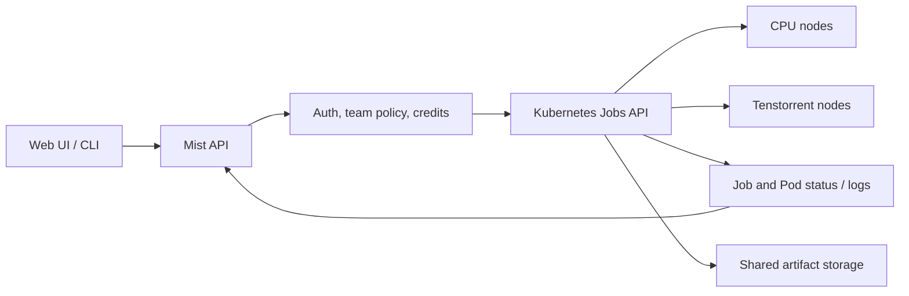

# Kubernetes execution pilot

## Decision

Pilot **k3s on one disposable CPU node or VM** and use Kubernetes `batch/v1` Jobs as Mist's execution primitive. Keep the existing Docker/Redis development path working while the pilot is built. Do not install k3s on the shared Tenstorrent box until a CPU job has completed through Mist and the device integration has been validated on that box.

A separate single-node NVIDIA GPU hardware pilot now exists. Its
[setup runbook](../deploy/k3s/setup-runbook.md) records GPU scheduling and CUDA
validation; it does not complete the first CPU job path through Mist described
below.

Kubernetes should own pod placement, resource accounting, restarts, and Job lifecycle. Mist should own authentication, job admission, user/team policy, priority, credits, and the user-facing API. A second Mist scheduler competing with Kubernetes for node placement would make both systems harder to reason about.

## Why this is a pilot, not a deployment recipe

The current `/jobs` endpoint enqueues a Redis message. The supervisor launches a CPU Docker container with `sleep 1000`, waits two seconds, then reports success; it does not run the submitted payload. For a GPU job it can report success without starting a container. All supervisors share one Redis consumer group, so a supervisor that reads an incompatible GPU job leaves it pending instead of offering it to the right worker. The web Jobs page and CLI still use sample data, and `/auth/login` is a placeholder. Installing k3s alone fixes none of these application paths.

The first end-to-end slice should replace those behaviors for **CPU jobs**:

1. Define a validated submission contract: image, command/arguments, CPU and memory limits, optional artifact location, owner, and maximum run time. Use an approved image list or registry policy before accepting arbitrary images from users.
2. Add a Kubernetes executor behind the Mist API. Create a namespaced `batch/v1` Job with `restartPolicy: Never`, explicit resource requests/limits, `backoffLimit`, `activeDeadlineSeconds`, and Mist job/owner labels. Give the API only namespaced permissions for the resources it uses.
3. Make submission, status, cancellation, and logs read the Kubernetes Job/Pod state. Persist the Mist job ID to Kubernetes Job name mapping and owner data independently of the Job TTL. Return a real failure when the workload fails.
4. Connect the CLI and Web UI to those endpoints. A user should be able to run a small CPU command and see its actual output and exit status.
5. Add namespace quotas, per-job limits, network restrictions, and durable audit/usage records before inviting pilot users. Treat priority and credits as Mist admission rules; map admitted priority to Kubernetes `PriorityClass` only after defining preemption policy.

## Tenstorrent milestone

Tenstorrent's `tt-operator` supports Wormhole and Blackhole devices. Its core stack needs Kubernetes 1.27+, and its Dynamic Resource Allocation (DRA) path needs **1.33+**. The operator also documents host kernel-header and registry requirements; its bundled PMIx webhook needs cert-manager unless disabled. Check the actual QuietBox generation, driver/firmware ownership, topology, kernel, and operator support before choosing chart values. Do not model a Tenstorrent device as a generic GPU string or assume that exposing `/dev/tenstorrent` is sufficient scheduling isolation.

For a first TT workload: install and validate the vendor stack on a test node, verify that Kubernetes advertises the expected allocatable devices/claims, run one vendor example Job, then teach Mist to request that resource. Keep the existing host driver in place until the operator's driver management has been planned and tested. Multi-node jobs and topology-aware placement come later.

## Storage and operations

K3s includes a local-path storage provisioner, but its volumes are tied to a node. Use it only for disposable pilot data. Select shared storage or an object store for input datasets, logs, checkpoints, and output artifacts before adding more nodes. Keep retained job metadata and logs after Kubernetes Job cleanup.

Start the API without public ingress and use `kubectl port-forward` for the pilot. Do not put the current placeholder authentication endpoint or a cluster administrator credential behind an internet-facing service. Deploy a dedicated Mist namespace and service account with the least permissions needed for Jobs, Pods, and logs. Back up the k3s datastore before any production use.

## Pilot acceptance checks

- One submitted CPU command runs to completion and returns its real exit code.
- A failing command is shown as failed, with retrievable logs.
- A canceled Job stops its pod and remains canceled in Mist's history.
- An incompatible hardware request stays pending or is rejected clearly; it is never reported as successful without execution.
- CPU/memory limits and namespace quota prevent a user from monopolizing the node.
- The Web UI and CLI show the same job state as the API.

Only then move the pilot to a Tenstorrent node and add the vendor operator.

The NVIDIA test node's [setup and incident runbook](../deploy/k3s/setup-runbook.md)
and [repeatable CUDA smoke Job](../deploy/k3s/README.md) record the current
hardware pilot. NVIDIA validation is separate from Tenstorrent device support.

## References

- [K3s installation requirements](https://docs.k3s.io/installation/requirements)
- [K3s packaged components and storage](https://docs.k3s.io/)
- [Kubernetes Job API](https://kubernetes.io/docs/reference/kubernetes-api/batch/job-v1/)
- [Tenstorrent operator platform support](https://docs.tenstorrent.com/tt-operator/latest/platform-support.html)
- [Tenstorrent operator prerequisites](https://docs.tenstorrent.com/tt-operator/latest/prerequisites.html)
